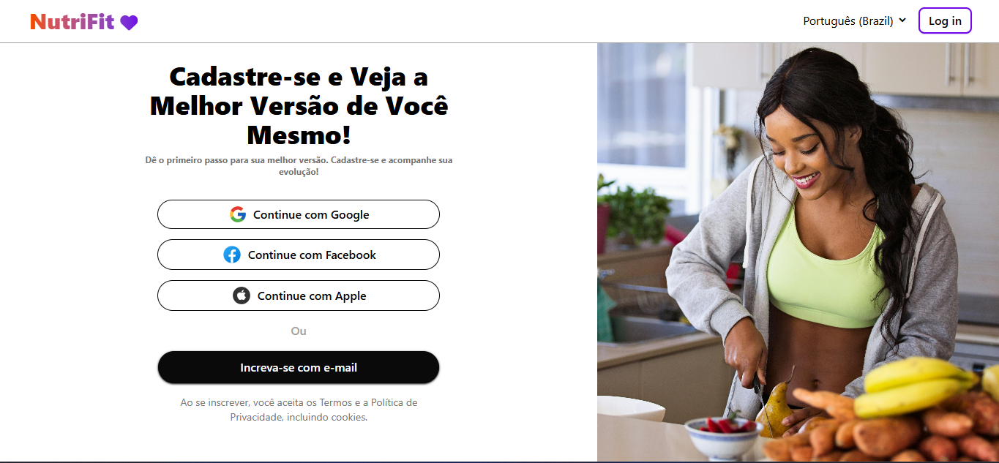

<h1 align="center">🍏 Nutri-Fut</h1>

<p align="center">
  Uma plataforma para cuidar da sua saúde, alimentação e bem-estar.
</p>

<div align="center">
  
  
  
</div>

---

## 🚀 Sobre o Projeto

O **Nutri-Fut** é uma plataforma focada em promover o bem-estar de pessoas que buscam melhorar sua saúde física e mental através do **autocuidado**, **controle de peso** e **alimentação saudável**.

A ideia surgiu como parte de um projeto de extensão acadêmico, com o objetivo de desenvolver algo útil, bonito e funcional para o dia a dia das pessoas.

---

## 🧠 Funcionalidades (em desenvolvimento)

- [x] Tela inicial com visual moderno
- [x] Cadastro de usuário
- [ ] Controle de peso e IMC
- [ ] Sugestões personalizadas de alimentação
- [ ] Área de dicas e receitas saudáveis

---

## 📸 Prévia

> Veja abaixo uma prévia da plataforma:

<p align="center">
  
</p>

---

## 🛠️ Tecnologias utilizadas

- HTML5
- CSS3
- JavaScript Vanilla
- Git & GitHub
- (Planejamento visual com Figma)

---

## 📂 Como rodar o projeto

```bash
# Clone o repositório
git clone https://github.com/seu-usuario/nutri-fut

# Acesse a pasta
cd nutri-fut

# Abra o index.html no navegador
