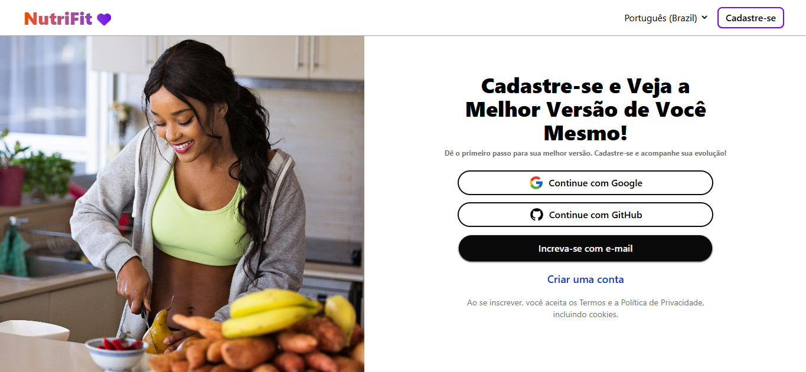
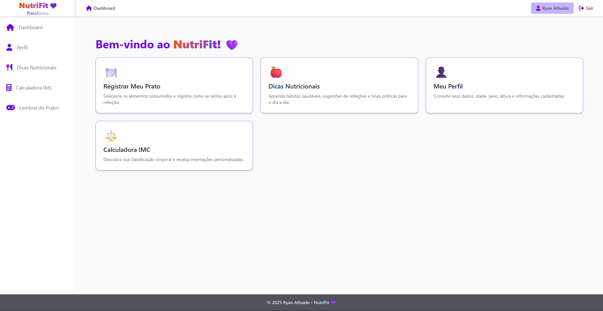
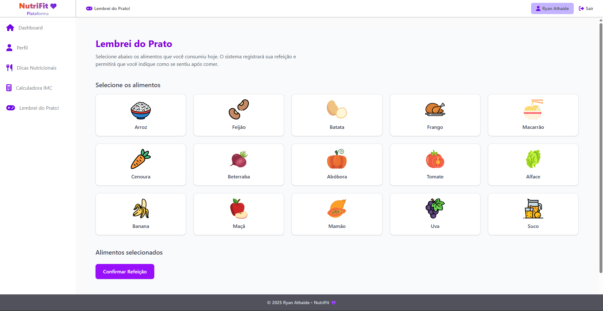
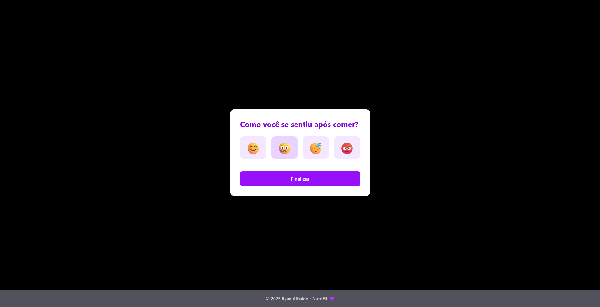

<h1 align="center">🍏 Nutri-Fut</h1>
<h3 align="center">07-Dez-2025</h3>

<p align="center">
  Uma plataforma para cuidar da sua saúde, alimentação e bem-estar.
</p>

<div align="center">
  
  
  
</div>

---
# 🧠 Sobre o Projeto

O **NutriFit** é uma plataforma web que visa auxiliar usuários — desde crianças até adultos — na construção de uma rotina de saúde mais equilibrada.

O sistema oferece:

- Controle alimentar através de seleção por imagens
- Monitoramento de humor após refeições
- Dicas nutritivas filtráveis
- Cálculo de IMC
- Perfil do usuário conectado via Firebase Authentication
- Interface moderna, leve e responsiva

O projeto foi desenvolvido como **projeto de extensão acadêmica**, com foco em ferramentas digitais voltadas para educação alimentar.

---

# ⭐ Funcionalidades Principais

- ✔ Dashboard moderno e responsivo  
- ✔ Perfil do usuário com foto (Google OAuth)  
- ✔ Consulta de dicas nutricionais com filtros  
- ✔ Calculadora IMC integrada  
- ✔ Jogo educativo **“Lembrei do Prato”**  
- ✔ Layout responsivo (mobile, tablet, desktop)  
- ✔ Autenticação via Firebase (Email/Senha & Google)  

---

## 📸 Prévia

> Veja abaixo uma prévia da plataforma: Desktop 💻

<p align="center">
  
</p>

---

> Veja abaixo uma prévia da plataforma: Mobile 📲

<p align="center">
  
</p>

---

# 🖼 Demonstrações (com prints)

---

## 🧭 Dashboard
Tela principal do usuário com atalhos para todas as funções.

<!-- IMAGEM AQUI — Dashboard -->
> Veja abaixo a section - **Dashboard**:

<p align="center">
  
</p>

---

## 👤 Perfil do Usuário
Exibe foto, nome e e-mail do usuário autenticado.

<!-- IMAGEM AQUI — Perfil -->
> Veja abaixo a section - **Perfil do Usuário**:

<p align="center">
  
</p>

---

## 🥑 Dicas Nutritivas
Lista filtrável com sugestões de alimentação saudável.

<!-- IMAGEM AQUI — Dicas Nutritivas -->
> Veja abaixo a section - **Dicas Nutritivas**:

<p align="center">
  
</p>

---

## ⚖️ Calculadora IMC
Calcula o Índice de Massa Corporal e gera feedback imediato.

<!-- IMAGEM AQUI — IMC -->
> Veja abaixo a section - **Calculadora IMC**:

<p align="center">
  
</p>

---

## 🎮 Jogo “Lembrei do Prato”
A criança seleciona o alimento pela imagem e registra como se sentiu.

<!-- IMAGEM AQUI — Jogo -->
> Veja abaixo a section - **Lembrei do Prato**:

<p align="center">
  
  
</p>

---


# 🛠 Tecnologias Utilizadas

| Tecnologia              | Uso                               |
|------------------------|------------------------------------|
| **HTML5**              | Estrutura das páginas              |
| **CSS3 + TailwindCSS** | Estilização rápida e responsiva    |
| **JavaScript (ES6)**   | Lógica do front-end                |
| **Firebase Authentication** | Login e dados do usuário     |
| **Firebase Firestore** | Armazenamento                      |
| **Vite**               | Ambiente de desenvolvimento rápido |
| **Git & GitHub**       | Versionamento                      |

---

# 👨‍💻 Autor

<p align="center">
  
</p>

<p align="center">
Link Reposiório GitHub: 
<a>https://github.com/RyanAthaide/NutriFit</a>
</p>

<p align="center">
  <strong>Ryan Athaide da Silva</strong><br/>
  Estudante de Bacharelado em Engenharia de Software.<br/>
  Apaixonado por desenvolvimento web, IA e automação.
</p>

<h5 align="center">07-Dez-2025</h5>

---


# 🚀 Como Executar o Projeto

```bash
# Clone o repositório
git clone https://github.com/RyanAthaide/NutriFit

# Acesse a pasta
cd NutriFit

# Instale as dependências
npm install

# Rode o projeto
npm run dev